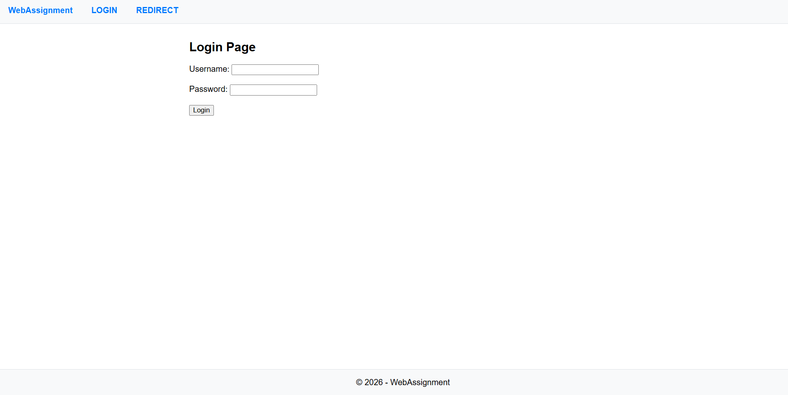
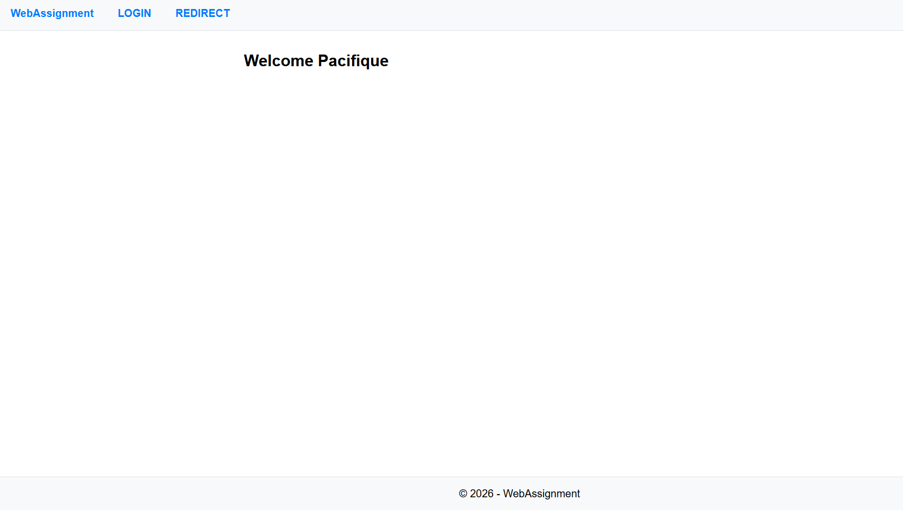
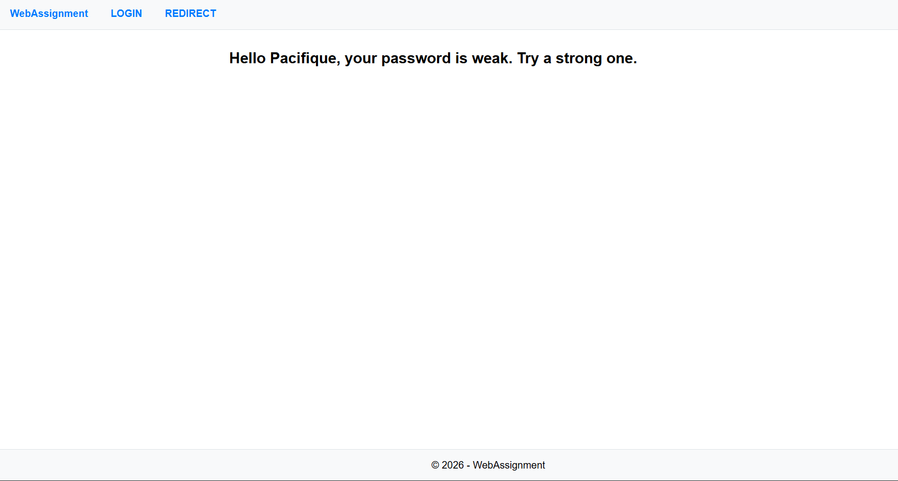
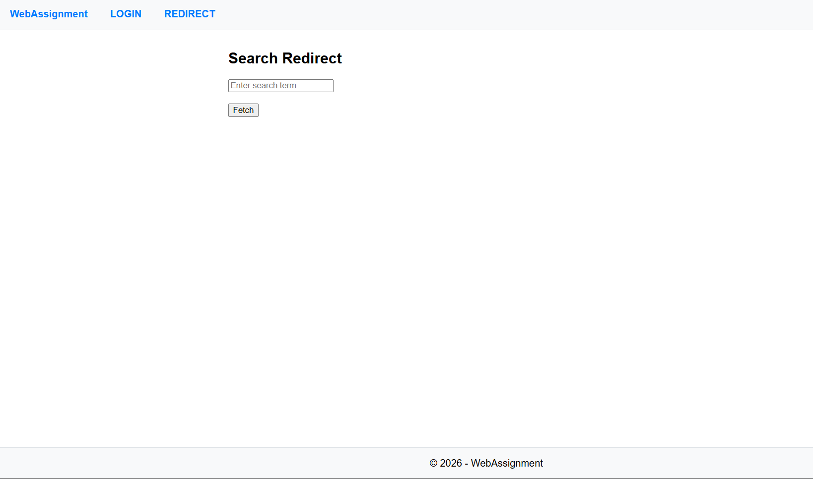
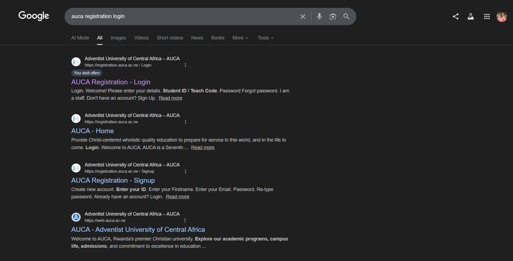

# MyWebAssignment - Java Servlet Project

**Student ID:** 26937  
**Group:** C Tuesday  
**Branch:** servlet_26937_C_tuesday

## Overview
A Java web application demonstrating servlet-based authentication with password validation and Google search redirect functionality.

## Features
- User authentication with password strength validation
- Strong password requirement (8+ characters)
- Google search redirect functionality
- Session management
- Dynamic welcome messages based on password strength
- Clean HTML interface

## Project Structure
```
MyWebAssignment/
├─ src/
│   ├─ LoginServlet.java      # Handles user authentication
│   └─ RedirectServlet.java    # Manages post-login redirects
├─ WebContent/
│   ├─ index.html             # Landing page
│   ├─ login.html             # Login form
│   ├─ redirect.html          # Success page
│   └─ WEB-INF/
│       └─ web.xml            # Servlet configuration
└─ pom.xml                    # Maven configuration
```

## Screenshots

### 1. Login Page

*User authentication form with username and password fields*

### 2. Strong Password Success

*Welcome message for users with strong passwords (8+ characters): "Welcome <username>"*

### 3. Weak Password Warning

*Warning message for weak passwords (<8 characters): "Hello <username>, your password is weak. Try a strong one."*

### 4. Redirect Search Page

*Google search redirect page where users can enter search terms*

### 5. Redirect Success

*Successful redirect to Google search results (example: "auca registration login")*

## Quick Start

### Prerequisites
- Java 8+
- Apache Tomcat 9+
- Maven 3.6+

### Running the Application
```bash
# Clone the repository
git clone https://github.com/Pacifique16/Servelet-assignment.git
cd Servelet-assignment
git checkout servlet_26937_C_tuesday

# Build with Maven
mvn clean package

# Deploy to Tomcat
cp target/MyWebAssignment.war $TOMCAT_HOME/webapps/

# Start Tomcat
$TOMCAT_HOME/bin/startup.sh
```

## Authentication Rules
- **Any username** is accepted
- **Strong Password:** 8+ characters → Shows "Welcome <username>"
- **Weak Password:** <8 characters → Shows "Hello <username>, your password is weak. Try a strong one."

### Example Credentials
- **Strong:** username: `admin`, password: `password123` (8+ chars)
- **Weak:** username: `user`, password: `123` (<8 chars)

## Access URLs
- **Login Page:** http://localhost:8080/MyWebAssignment/login.html
- **Login Processing:** http://localhost:8080/MyWebAssignment/login
- **Redirect Page:** http://localhost:8080/MyWebAssignment/redirect.html
- **Redirect Processing:** http://localhost:8080/MyWebAssignment/redirect

## Servlet Mappings
- `/login` → LoginServlet (handles authentication & password validation)
- `/redirect` → RedirectServlet (handles Google search redirects)

## Application Flow
1. **Login:** User enters credentials
2. **Validation:** System checks password strength (8+ characters)
3. **Response:** 
   - Strong password → "Welcome <username>"
   - Weak password → Warning message
4. **Redirect:** User can search terms to redirect to Google
5. **Search:** System redirects to Google with search query

## Technologies Used
- Java Servlets
- HTML/CSS
- Apache Tomcat
- Maven


## 📝 License

© Copyright 2026 Pacifique Harerimana

This project is for educational purposes as part of AUCA Web Technology and Internet Coursework. Feel free to fork and learn from it, but please give credit where it's due.


## ⭐ Show Your Support

**If you found this project helpful or interesting, please consider giving it a star!** 🌟

Your support motivates me to create more educational projects and helps others discover useful resources.


## 👨‍💻 Author
**Pacifique Harerimana**  
AUCA Student - Web Technology and Internet 

📧 Contact: [GitHub](https://github.com/Pacifique16)


##
*Built with ❤️ for learning and sharing knowledge*
